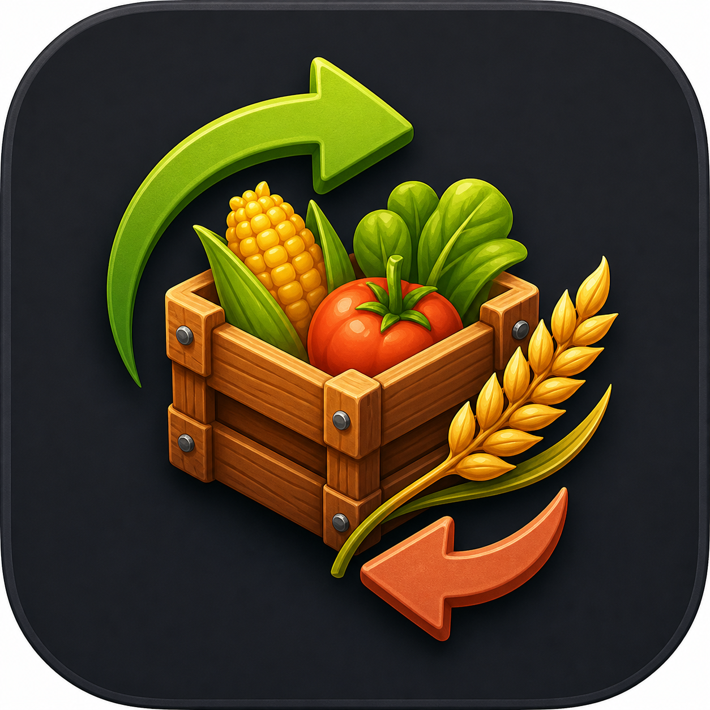
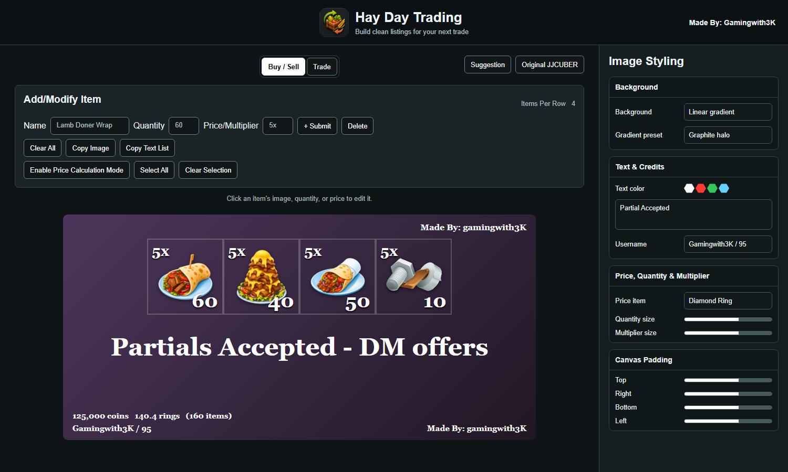
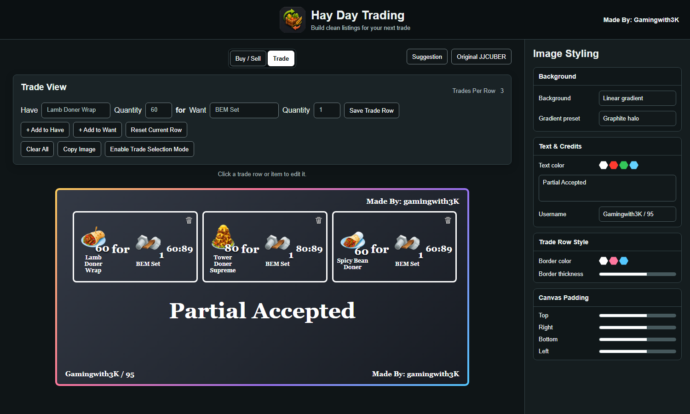

<div align="center">
  
  <h1>Hay Day Trading</h1>
  <p>Create polished Buy/Sell sheets and ratio-based Trade listings that are ready to share on Discord.</p>
</div>

Hay Day Trading is a browser-based image generator for Hay Day listings. It combines item autocomplete, live price calculations, multi-item trades, reusable sheets, and a detailed styling editor in one responsive interface.

The site stores listings and preferences in the browser, so work is restored when the page is reopened.

## Buy / Sell



The Buy/Sell workspace creates compact item grids with quantities and prices or multipliers.

- Add, update, or delete items from a listing.
- Choose how many items appear in each row.
- Use fuzzy autocomplete and custom item abbreviations.
- Display fixed quantities or infinity quantities.
- Show or hide quantity and price labels independently.
- Adjust quantity and multiplier text sizes.
- Copy the generated image directly to the clipboard.
- Copy the listing as a configurable text list.
- Automatically calculate coin value, price-item value, and total quantity.

### Price Calculation Mode

Price Calculation Mode supports temporary calculations without changing the saved listing immediately.

- Select individual items or select all items.
- Enter temporary quantity and price values.
- Show selected totals inside the generated image footer.
- Subtract selected quantities from the saved stock.
- Delete selected items or hide everything that is not selected.
- Reset temporary values and optionally view the calculation equation.
- Infinite stock remains infinite when selected quantities are subtracted.
- Totals that include infinity display `N/A` beside the currency icons.

## Trade



Trade View builds one or more Have-for-Want deals. Each saved trade is displayed as a self-contained row inside the generated image.

- Add multiple item types to either side of one trade.
- Combine items such as `200 Pickaxes + 100 Shovels for 5 BEM Sets`.
- Add multiple independent trade rows to the same image.
- Edit a complete row or click a specific item to edit that item first.
- Remove individual rows using the delete control.
- Choose up to four trades per row.
- Display calculated ratios such as `60:89`.
- Treat BEM, LEM, SEM, and TEM sets as 89-item sets when calculating ratios.
- Keep Buy/Sell totals out of Trade images.

### Trade Selection Mode

Trade Selection Mode helps create a smaller image from a larger saved trade list.

- Select or clear multiple trade rows.
- Delete selected rows.
- Hide unselected rows while preserving them in the sheet.
- Newly saved rows remain visible when the unselected-row filter is active.

## Image Styling

Buy/Sell and Trade maintain separate styling settings. The desktop styling drawer stays fixed beside the workspace and can be collapsed. On mobile it opens as an overlay.

Available controls include:

- Solid, linear-gradient, and circular-gradient backgrounds.
- Dark and light gradient presets.
- Hexagonal color palettes for backgrounds, borders, and text.
- Custom bottom text with an independent visibility option.
- User credit and the `Made By: Gamingwith3K` label.
- Buy/Sell quantity and multiplier styles.
- Trade row border color and thickness.
- Top, right, bottom, and left canvas padding.
- A dedicated reset button for canvas padding.
- Automatic black or white credits based on background brightness.

Bottom text scales to fit the generated image, while reserved footer space keeps it from overlapping totals or credits.

## Sheets And Local Storage

Buy/Sell and Trade use separate sheet collections.

- Create, rename through creation, switch, and delete reusable sheets.
- Start a blank sheet or optionally copy the current items.
- Start with default styling or optionally include current settings.
- Keep the active Buy/Sell and Trade sheets independent.
- Save items, trade rows, styling, abbreviations, and preferences in `localStorage`.
- Export all browser data to JSON and import it later as a backup.

Clearing browser storage or using private browsing may remove locally saved data. Export a backup before clearing site data or moving to another browser.

## Sharing And Feedback

- **Copy Image** generates a PNG and writes it to the clipboard.
- A progress state reports when copying is in progress, completed, or unsuccessful.
- If clipboard access fails, the generated image is shown for manual saving.
- **Copy Text List** supports newline, comma, or custom separators and a customizable format using `{{name}}`, `{{quantity}}`, and `{{price}}`.
- **Suggestion** opens an in-app form for a Discord username or incognito submission, category, message, and optional screenshot. It submits through Formspree without redirecting away from the site.

## Product Data

Standard item names, images, and maximum prices are fetched on demand from the [Hay Day Wiki](https://hayday.fandom.com/) API. A small number of custom or newly added items use local PNG assets included in this repository.

Previously loaded product images and Hay Day Wiki responses are cached by a service worker for faster repeat visits. An internet connection is still required for the first load of CDN libraries and product data that is not bundled locally.

## Running Locally

This is a static HTML, CSS, and JavaScript project. No build step is required.

1. Clone the repository.
2. Start a local HTTP server from the project directory:

   ```bash
   python -m http.server 8000
   ```

Please make sure to give credit to Gamingwith3K if you are going to modify the website for personal use.

3. Open `http://localhost:8000`.

Using a local server is recommended because clipboard APIs and remote data requests may not work when `index.html` is opened directly from the filesystem.

## Credits

This project builds on the original [JJCUBER Hay Day Image Generator](https://jjcuber.github.io/HayDayImageGeneratorSite/) and extends it with Trade View, modern styling, separate sheets, selection modes, local persistence, and additional export controls.

Hay Day is a trademark of Supercell. This fan-made project is not affiliated with or endorsed by Supercell.

## License

Licensed under the [Apache License 2.0](LICENSE).
